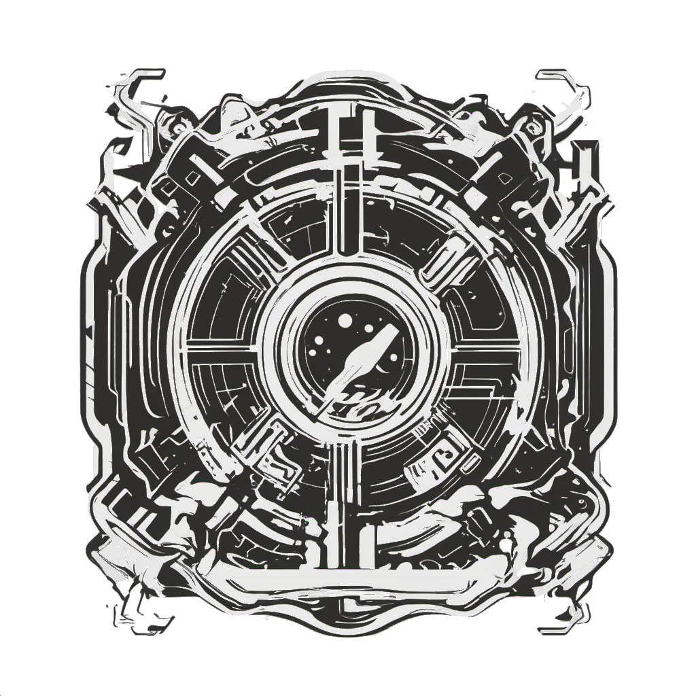

# Techno Tome: Sci-Fi Book Subscription Service

## Introduction

Techno Tome is a web application designed as a concept sci-fi book subscription service that allows users to explore various science fiction and cyberpunk books in a 3D virtual environment. 

This is a personal project made over the course of 2 days to develop my skills in using 3D models in React.

    

## Demo

[Check out the live demo here](https://prontopablo.github.io/TechnoTome/)

## Technologies Used

- [React](https://reactjs.org/) - JavaScript library for building user interfaces.
- [Three.js](https://threejs.org/) - JavaScript 3D library.
- [React Three Fiber](https://docs.pmnd.rs/react-three-fiber/getting-started/introduction) - A React renderer for Three.js.
- [GLTFLoader](https://threejs.org/docs/#examples/en/loaders/GLTFLoader) - A loader for GLTF models in Three.js.
- [Drei](https://drei.pmnd.rs/) - A collection of useful helpers for React Three Fiber.
- [React Portals](https://reactjs.org/docs/portals.html) - To render the dropdown content outside the normal component hierarchy.

## License

This project is licensed under the MIT License. Feel free to use, modify, and distribute this code for personal and commercial purposes.

---
